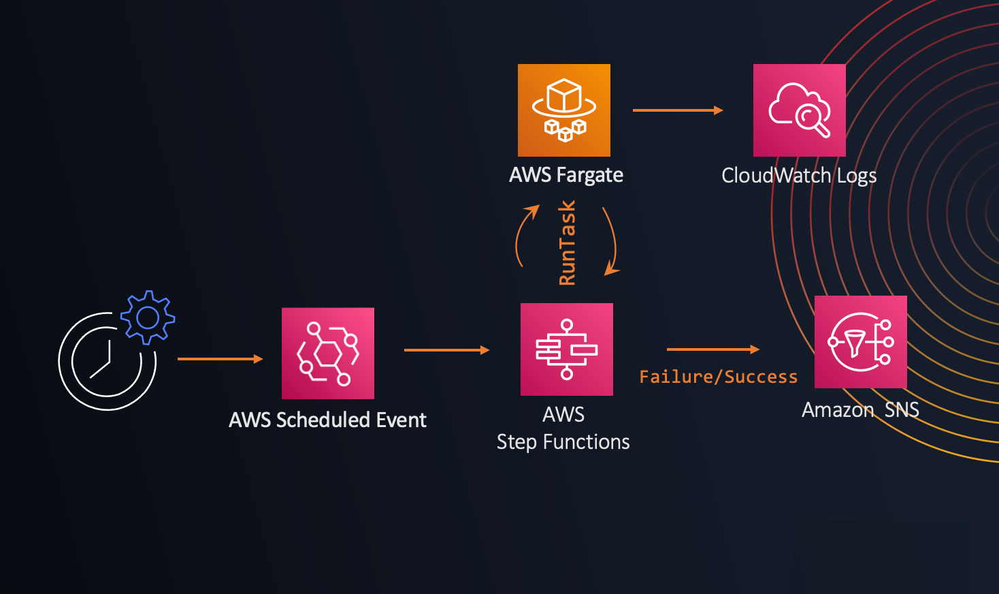

# Running Sunchronous RunTask API calls via AWS Step Functions

## Context

Launching an ECS tasks, including Fargate tasks, via the `RunTask` API call or CloudWatch Events involves an asynchronous workflow. A success return code from the RunTask API indicates this workflow was successfully started, yet the underlying task might not reach a **RUNNING** state.

For example using `ECS RunTask` as a target via CloudWatch Events the event is marked as successful even if the started ECS Task failed to start.

Different reasons for a task not to reach a **RUNNING** state may include:

* If the Fargate service tries to attach an elastic network interface to the underlying infrastructure that the task is meant to run on, then you can receive the following error message: "Timeout waiting for network interface provisioning to complete."
* If your `awsvpc` enabled tasks can't launch because the elastic network interface wasn't created during the task provisioning state, then you can receive the following error message: "network interface provision complete error timeout wait for network interface provision."
* If the ECS Agent fails to pull the specified container image in the task definition.
* The Docker daemon is unresponsive.
* The Underlying instance's filesystem is full.
* The Amazon ECS container agent lost connectivity with the Amazon ECS service in the middle of a task launch.
    
If any of these conditions are satisfied, the caller will be expected to verify that the task reaches a running state and retry the operation in a case of failure. 

CloudWatch Events or AWS CLI do not include a retry logic nor a way to monitor if the Task reaches a **RUNNING** state, hence a manual retry needs to be perfomed.

## Solution

AWS Step Functions offers integration with ECS that allows you to launch ECS tasks via State Machines. 

Using the Amazon States Language, we can configure a State Machine to perform `RunTask` operations synchronously for us by providing a way to catch any unsuccessful return codes from the launched tasks, and perform a back-off retry logic in case its necessary.

In this AWS Samples, you can deploy this solution by creating a Scheduled Event via AWS EventBridge which invokes a State Machine which finally notifies via an SNS Topic of any Successful or Failed `RunTask` Invocations.



The main logic of the synchronous `RunTask` resides in the `Retry` and `Catch` operations of the State Machine:

```
        "Retry": [
          {
            "ErrorEquals": [
              "States.ALL"
            ],
            "IntervalSeconds": 10,
            "MaxAttempts": 3,
            "BackoffRate": 2
          }
        ],
        "Next": "Notify Success",
        "Catch": [
          {
            "ErrorEquals": [
              "States.ALL"
            ],
            "Next": "Notify Failure"
          }
        ]
```

Which captures and retries any error returned by the Started task, and performs an exponential backoff-retry logic based on the AWS best practices:

https://docs.aws.amazon.com/general/latest/gr/api-retries.html

If the task is started successfuly or fails to start, the State Machine will notify all the subscribers of the specified SNS Topic:

```
      "Notify Success": {
        "Type": "Task",
        "Resource": "arn:aws:states:::sns:publish",
        "Parameters": {
          "Message": "AWS Fargate Task started by Step Functions succeeded",
          "TopicArn": "REPLACE_ME_WITH_SNS_TOPIC_ARN"
        },
        "End": true
      },
      "Notify Failure": {
        "Type": "Task",
        "Resource": "arn:aws:states:::sns:publish",
        "Parameters": {
          "Message": "AWS Fargate Task started by Step Functions failed",
          "TopicArn": "REPLACE_ME_WITH_SNS_TOPIC_ARN"
        }
```


#### Deploy the solution with AWS CloudFormation

To automate the deployment of this solution, you can use [this](cfn-template.yml) CloudFormation template.

## License

This library is licensed under the MIT-0 License. See the LICENSE file.


